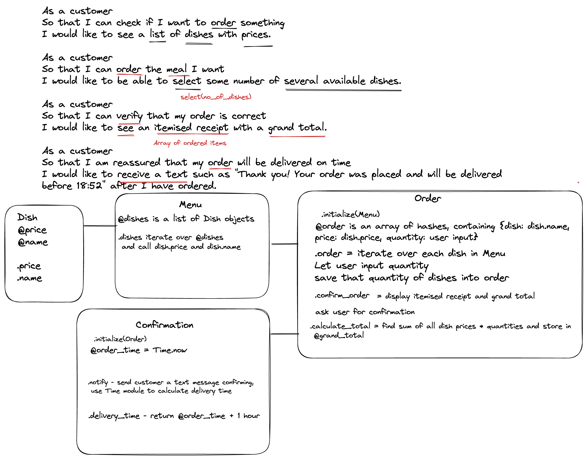

# Solo Project Design Recipe

## Describe the Problem

> As a customer
> 
> So that I can check if I want to order something
> 
> I would like to see a list of dishes with prices.

> As a customer
> 
> So that I can order the meal I want
> 
> I would like to be able to select some number of several available dishes.

>As a customer
>
>So that I can verify that my order is correct
>
>I would like to see an itemised receipt with a grand total.

>As a customer
>
>So that I am reassured that my order will be delivered on time
>
>I would like to receive a text such as "Thank you! Your order was placed and will be delivered before 18:52" after I have ordered.

## Design the Class System



```ruby
class Dish
  def initialize(name, price) #string, int
    @name = name
    @price = price
  end

  def price
    @price
  end

  def name
    @name
  end
end

class Menu
  def intitialize
    @dishes = [] # Takes an array of dish objects
  end

  def add(dish) # Takes a dish object, optionally expand with optional arguments so multiple dishes can be added
    @dishes << dish
  end

  def remove(dish) # Takes a dish object
    @dishes.delete(dish)
  end

  def read
    @dishes.map { |dish| puts "#{dish.name}: £#{dish.price}" }
  end
end

class Order
  @@total_orders = 0

  def initialize(name) # Takes the customer's name, could expand to take address etc
    @name = name
    @basket = [] # will contain hashes
    @@total_orders += 1
    @order_id = @@total_orders
  end

  def basket # user can check their basket
    @basket
  end

  def name
    @name
  end

  def order_id
    @order_id
  end

  def order_from(menu) # takes a menu object
    # Iterate through the menu, displaying each dish with price
    # use gets.to_i to let user select quantity of each dish,
    # add {dish: dish.name, quantity: quantity, price: quantity * dish.price} to @basket
  end

  def confirm_order # Consider breaking this out into a separate class
    print create_receipt
    print calculate_total
    @order_time = Time.now
    # bonus - ask user for confirmation of order
    # bonus - use gets for y/n
  end

  private

  def calculate_total
    return sum of all price values in @basket
  end

  def create_receipt
    # consider creating own class for receipt
    # iterate over each dish in basket, display all info in hash
  end
end

class Confirmation
  def initialize(order) # takes order
    @order_id = order.order_id
    @order_time = order.order_time
  end

  def delivery_time
    @order_time += 1 hour
  end

  def notify
    # use twilio gem to send user a text message confirming order and delivery time
    "Hello #{@order.name}! Your order number #{@order_id} has been received and will be delivered by #{@delivery_time}"
  end
end
```

## Create Examples as Integration Tests

```ruby
dish = Dish.new("Calamari", 3)
menu = Menu.new
menu.add(dish)
menu.read => "Calamari: £3"
```

```ruby
calamari = Dish.new("Calamari", 3)
chips = Dish.new("Chips", 2)
menu = Menu.new
menu.add(calamari)
menu.add(chips)
menu.read => "Calamari: £3\nChips: £2"
```

```ruby
calamari = Dish.new("Calamari", 3)
chips = Dish.new("Chips", 2)
menu = Menu.new
menu.add(calamari)
menu.add(chips)
order = Order.new("Tom")
order.order_from(menu)
# need to test gets and puts here
```


```ruby
calamari = Dish.new("Calamari", 3)
chips = Dish.new("Chips", 2)
menu = Menu.new
menu.add(calamari)
menu.add(chips)
order = Order.new("Tom")
order.order_from(menu)
# need to test gets and puts here
confirmation = Confirmation.new(order)
# need to control time variable in tests
confirmation.notify => "Hello Tom! Your order number #{@order_id} has been received and will be delivered by #{@delivery_time}"
```


## Create Examples as Unit Tests


